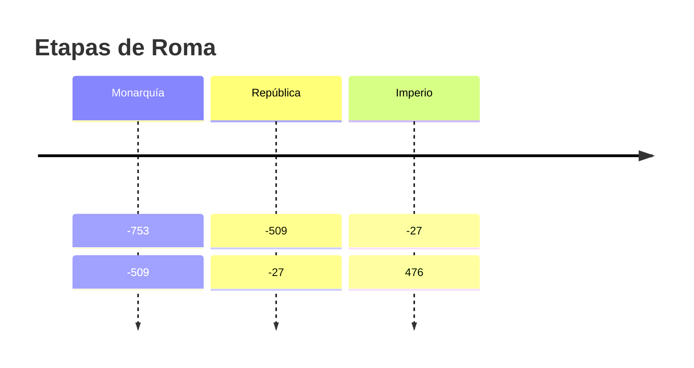

# 🛠 Manual interno de uso · Repositorio de Cultura Clásica

Este documento serve de **guía interna** para crear e xestionar contidos no sitio web feito con **MkDocs + Material**.  
Non se publica no blog, pero pode consultarse sempre desde o repositorio.

---

## 1️⃣ Estrutura do proxecto

O proxecto segue unha estrutura semellante a:

```bash

mkdocs\_cultura/
├── docs/                  # todo o que se publica na web
│   ├── index.md           # portada xeral
│   ├── UNIDADES/          # contidos organizados por trimestre/unidade
│   │   ├── 1AV/
│   │   │   ├── 1/
│   │   │   │   ├── index.md
│   │   │   │   ├── materiais/   # PDFs, imaxes, vídeos
│   │   │   │   ├── teoria/      # apuntes
│   │   │   │   └── textos/      # textos de lectura/exercicios
│   │   │   └── 2/...
│   │   └── 2AV/...
│   │   └── 3AV/...
│   └── assets/
│       └── stylesheets/
│           └── extra.css
├── mkdocs.yml             # configuración xeral (tema, menú, plugins)
└── README.md              # este manual de uso

```

📌 **Regras de ouro**  
- Todo o que estea en `docs/` publícase na web.  
- Os nomes de ficheiro **sen espazos**, preferiblemente en minúsculas e con guións baixos (`mapa_mudo_grecia.pdf`).  
- O `index.md` de cada unidade é a “portada” desa unidade.

---

## 2️⃣ Creación dunha nova unidade

1. **Crear carpetas**

```bash
   mkdir -p docs/UNIDADES/1AV/3/{materiais,teoria,textos}
```

(substitúe `1AV/3` polo trimestre e número que corresponda).

2. **Engadir index.md**

   * É a páxina principal da unidade.
   * Contén a presentación, as tarefas e ligazóns aos materiais.

   Exemplo mínimo:

```markdown
   # 🌍 Unidade 3 — Mitoloxía

   Benvida á terceira unidade. Aquí atoparás apuntes, materiais e actividades.

   ## 📂 Materiais
   - [Ficha de traballo](./materiais/ficha.pdf)
   - [Mapa mudo](./materiais/mapa_mudo_grecia.pdf)

   ## 📝 Teoría
   [Apuntes da unidade](./teoria/apuntes.md)

   ## 📜 Textos
   - [Mito de Europa](./textos/mito_europa.md)
```

3. **Actualizar o menú** (opcional)

   * Se usas `nav:` en `mkdocs.yml` con rutas fixas, engade a nova unidade.
   * Se usas `nav: - index.md` automático, non é preciso.

---

## 3️⃣ Formatos admitidos e recomendados

| Tipo de contido         | Como engadir                                                       | Como se ve                            |
| ----------------------- | ------------------------------------------------------------------ | ------------------------------------- |
| **Markdown (.md)**      | Edítase en texto plano                                             | Páxina web limpa e adaptable          |
| **PDF, DOCX, PPTX**     | Pon en `materiais/` e liga: `[Ficha](./materiais/ficha.pdf)`       | Ligazón para ver/descargar            |
| **Imaxes (.jpg, .png)** | `{width=60%}`                          | Mostra en liña, con control de tamaño |
| **Vídeos (.mp4)**       | `<video controls src="./materiais/video.mp4" width="600"></video>` | Reprodutor na páxina                  |
| **Áudio (.mp3)**        | `<audio controls src="./materiais/audio.mp3"></audio>`             | Reprodutor de audio                   |
| **Ligazóns externas**   | `[Museo del Prado](https://www.museodelprado.es){target=_blank}`   | Abre nunha pestana nova               |

---

## 4️⃣ Sintaxe útil de Markdown + Material

MkDocs-Material engade moitas opcións a Markdown tradicional.

### 4.1 Encabezados e navegación

```markdown
# Título 1
## Título 2
### Título 3
```

→ Xeran o índice lateral automaticamente.

### 4.2 Listas e listas de verificación

- Elemento normal
- [ ] Tarefa pendente
- [x] Tarefa feita

```markdown
- Elemento normal
- [ ] Tarefa pendente
- [x] Tarefa feita
```

### 4.3 Citas e callouts (avisos)

```markdown
!!! note "Lembra"
    Este é un recordatorio importante.

!!! warning "Coidado"
    Isto require atención especial.
```

### 4.4 Táboas

| Columna A | Columna B |
|-----------|-----------|
| Dato 1    | Dato 2    |

```markdown
| Columna A | Columna B |
|-----------|-----------|
| Dato 1    | Dato 2    |
```

### 4.5 Código e linguas

Para texto que queres resaltar ou mostrar como código:

```greek
ὁ ἄνθρωπος ζῷον πολιτικόν
```


### 4.6 Contido colapsable (preguntas/solucións)

```markdown
??? question "Quen é Zeus?"
    O deus supremo do Olimpo.
```

### 4.7 Imaxes avanzadas

```markdown
{ width=50% .rounded shadow }
```

---

## 5️⃣ Contido multimedia avanzado

### 5.1 Vídeos externos

```markdown
<iframe width="560" height="315" src="https://www.youtube.com/embed/ID" allowfullscreen></iframe>
```

### 5.2 Diagramas e liñas do tempo (Mermaid)




### 5.3 Galerías de imaxes con lightbox

```markdown
{.lightbox}
{.lightbox}
````

→ Ábrese como galería a pantalla completa.

---

## 6️⃣ Boas prácticas de traballo

* **Nomenclatura limpa**: sen espazos, nin acentos nin maiúsculas raras.
* **Separar teoría e materiais**: `teoria/` para apuntes e explicacións, `materiais/` para PDF/imaxes/vídeos.
* **Usar index.md como “guía da unidade”** con ligazóns a todo o resto.
* **Engadir metadatos** (opcional) con `title:` ou `description:` ao inicio do ficheiro se queres mellor SEO.

---

## 7️⃣ Ciclo de publicación

1. **Editar/crear contido** en `docs/`.
2. **Probar en local**:

   ```bash
   mkdocs serve
   ```

   Abre en `http://127.0.0.1:8000`.
3. **Publicar en GitHub Pages**:

   ```bash
   mkdocs gh-deploy
   ```

   Sobe automaticamente a rama `gh-pages` e actualiza o sitio.

---

## 8️⃣ Extensións activas recomendadas

No `mkdocs.yml` podes activar:

```yaml
markdown_extensions:
  - admonition
  - footnotes
  - pymdownx.details
  - pymdownx.superfences
  - pymdownx.emoji
  - pymdownx.tasklist
  - pymdownx.highlight
  - pymdownx.extra
  - attr_list
  - md_in_html
```

Estas extensións permiten:

* Callouts (`!!! note`),
* Seccións despregables (`??? question`),
* Código coloreado,
* Emojis (`:smile:`),
* Atributos de imaxe `{width=50%}`.

---

## 9️⃣ Exemplo completo de index.md

```markdown
# 🗺️ Unidade 1 — Xeografía Clásica

Benvido/a. Nesta unidade traballaremos o **Mediterráneo, Grecia e Italia**, con especial atención ás rutas comerciais.

## 📂 Materiais
- [Mapa mudo de Grecia](./materiais/mapa_mudo_grecia.pdf){target=_blank}
- [Ficha de traballo](./materiais/ficha_xeografia.pdf)

## 📝 Teoría
[Apuntes](./teoria/apuntes.md)

## 📜 Textos
- [Homero, Odisea: O mar como camiño](./textos/odisea_mar.md)

!!! note "Obxectivo da unidade"
    Comprender a importancia do Mediterráneo como espazo de contacto.

## 🎥 Vídeo recomendado
<iframe width="560" height="315" src="https://www.youtube.com/embed/ID" allowfullscreen></iframe>

## ❓ Actividade interactiva
??? question "Que é a tríade mediterránea?"
    O conxunto trigo–oliveira–vide que define a agricultura clásica.
```

---

## 1️⃣0️⃣ Checklist rápido antes de facer commit

* [ ] Nome de carpetas e ficheiros en minúsculas e sen espazos.
* [ ] Ligazóns relativas probadas (funcionan en `mkdocs serve`).
* [ ] PDF e imaxes optimizados (peso razoable).
* [ ] Probas en local sen erros.

---