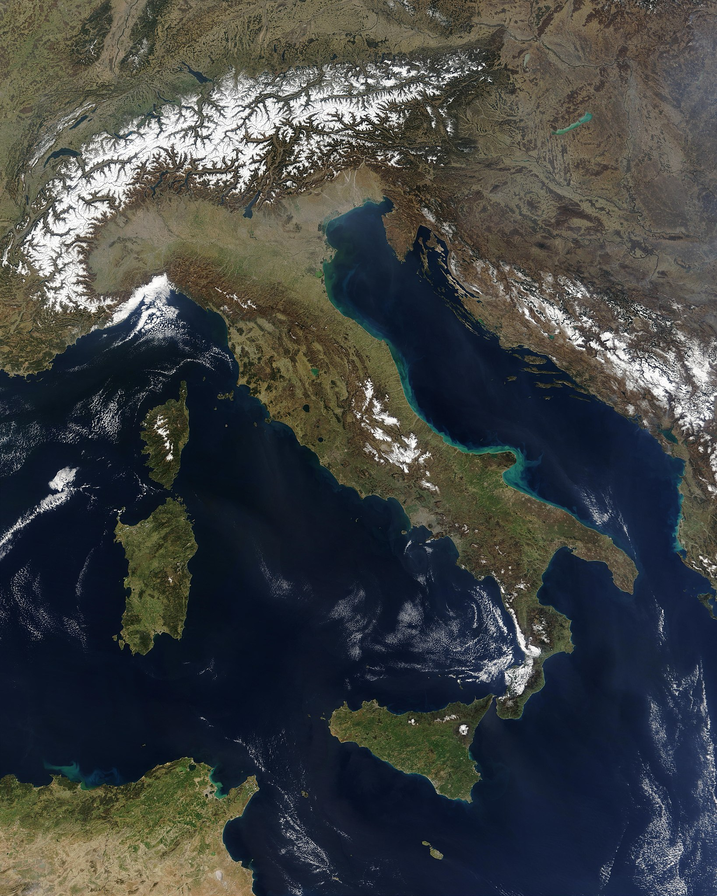

# Teoría UD1 · Xeografía clásica

## 1. O Mediterráneo
### 1.1 Clima e ventos
...texto...

## 2. Grecia
### 2.1 Relevo
...texto...

# 4 · Italia: unha ponte no Mediterráneo

!!! info "Idea clave"
    Italia, situada no corazón do Mediterráneo, foi dende a Antigüidade unha auténtica **ponte entre Europa, África e Oriente**, o que explica o seu papel decisivo na historia de Roma.

---

## 4.1 Situación xeográfica

{ width="70%" .shadow }

Italia é unha longa península en forma de bota que se proxecta cara ao sur, entre os mares **Tirreno** e **Adriático**.

> 💡 A súa **posición central** favoreceu a circulación de mercadorías, exércitos e ideas.

!!! example "Mapa interactivo recomendado"
<iframe 
    src="../materiais/mapa_italia_interactivo.html"
    width="100%" 
    height="600" 
    style="border: none;">
</iframe>

---

## 4.2 Relevo: cordilleiras e chairas

{ width="65%" .rounded }

O relevo italiano está dominado por **dúas grandes cordilleiras**:

- **Alpes**: ao norte, illan de Europa central e serven de defensa natural.
- **Apeninos**: percorren a península de norte a sur, dividíndoa en dúas vertentes e condicionando as comunicacións.

Entre estes macizos ábrese a **chaira padana**, regada polo **río Po**, un territorio de grande fertilidade que foi desde antigo un dos principais celeiros de cereais.

!!! tip "Zona agrícola clave"
    Máis ao sur, na rexión de **Campania**, a chaira campana ofreceu tamén solos ricos e un clima suave que favoreceron a agricultura.

---

## 4.3 Hidrografía: ríos vitais

{ width="60%" .shadow }

Os ríos italianos son xeralmente máis regulares ca os gregos.

- **Po**: de curso longo e caudaloso, nace nos Alpes e verte no Adriático, alimentando a chaira padana.
- **Tíber**: máis breve, discorre pola zona central e desemboca no Tirreno.

> 🏛️ **Roma** ergueuse a uns 25 km do mar, nas marxes do Tíber, nun lugar estratéxico:  
> protexido de incursións piratas, con acceso ao interior e próximo ao porto de **Ostia**.

---

## 4.4 Actividade volcánica: o Vesubio

{ width="65%" .rounded }

Italia é tamén unha **terra de volcáns**.  
O máis célebre é o **Vesubio**, que no ano **79 d.C.** entrou en erupción e **sepultou Pompeia e Herculano**.

!!! note "Recurso audiovisual"
    Podes inserir un vídeo divulgativo da erupción e das escavacións actuais, por exemplo:
    <iframe width="560" height="315" src="https://www.youtube.com/embed/ID_DO_VIDEO" allowfullscreen></iframe>

A espectacular conservación destes xacementos permite coñecer con detalle a **vida cotiá dunha cidade romana do século I**.

---

## 4.5 Para seguir traballando

- [Mapa interactivo: Italia físico e político](../materiais/mapa_italia_interactivo.html){target=_blank}
- [PDF imprimible co resumo teórico](../materiais/italia_teoria.pdf)
- [Vídeo: “Roma e o Tíber, unha relación vital”](../materiais/video_tiber.mp4)
