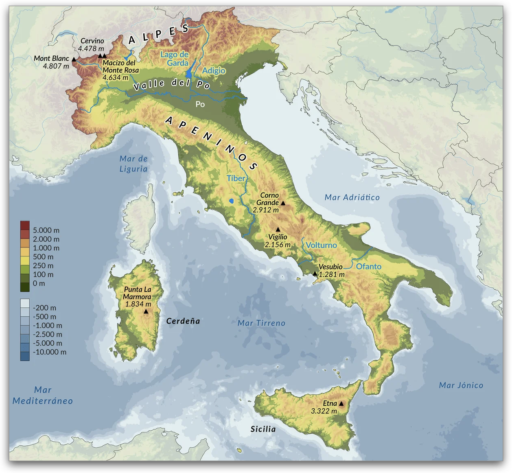
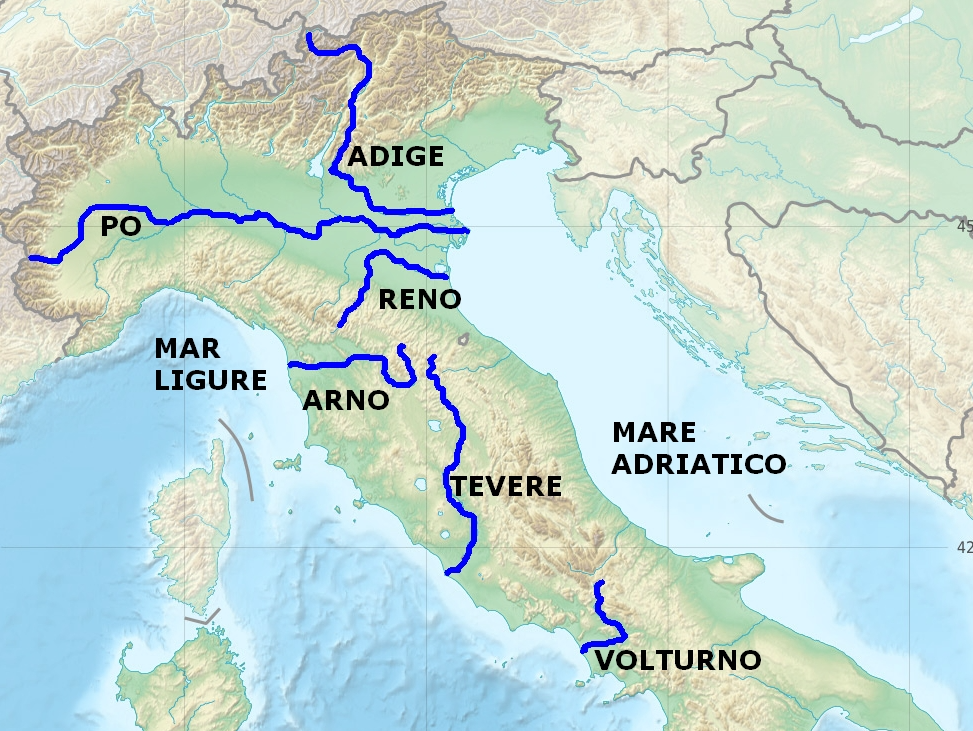

# Teoría UD1 · Xeografía clásica

## 1. O Mediterráneo

O **Mediterráneo** é un mar interior que une tres continentes: **Europa, Asia e África**.  
O seu propio nome vén do latín *mediterraneus*, “no medio das terras”.

- A súa **forma alongada e con múltiples illas e golfos** favoreceu a navegación de cabotaxe, sempre a pouca distancia da costa.
- A comunicación co Atlántico prodúcese só a través do **estreito de Xibraltar**, unha auténtica porta estratéxica.

!!! info "Un mar de civilizacións"
    Polas súas augas circularon fenicios, gregos, cartaxineses e romanos.  
    Foi a gran **autopista comercial e cultural da Antigüidade**, permitindo o intercambio de produtos, ideas e crenzas.

### 1.1 Clima e ventos

O clima mediterráneo caracterízase por **invernos suaves e veráns secos e cálidos**.  
Esta combinación fixo posible a chamada **tríade mediterránea**: trigo, vide e oliveira.

- Ventos como o **etesio** (no Exeo) ou o **mistral** (en occidente) creaban rutas previsibles e seguras para a navegación a vela.
- As correntes internas actuaban como auténticos corredores marítimos.

??? tip "O Mar Mediterráneo"
    

      <iframe
        src="https://www.youtube.com/embed/UsMWEWdF2PY"
        title="O Mar Mediterráneo"
        loading="lazy"
        allowfullscreen></iframe>
    

---

## 2. Grecia

!!! example "Mapa interactivo de Grecia"
    

      <iframe 
          src="../assets/mapa_grecia_interactivo.html"
          title="Mapa interactivo: Grecia clásica"
          loading="lazy"
          allowfullscreen
          style="border:0;"></iframe>
    

A **península grega** é un auténtico **labirinto de montañas e illas**, o que condicionou a súa historia e cultura.

### 2.1 Relevo

O territorio está formado por **cadeas montañosas abruptas** (Pindo, Olimpo, Taixeto), con **vales estreitos e costas recortadas**.

- A orografía dificultou as comunicacións por terra, favorecendo a aparición de **polis independentes** como Atenas, Esparta ou Corinto.
- A multitude de illas e golfos propiciou unha forte **vocación mariñeira e comercial**.

!!! info "Influencia do relevo na sociedade"
    A paisaxe montañosa favoreceu economías de pequena escala (olivar, viñedo, gando) e un **espírito político localista**.  
    O mar, en cambio, converteuse nunha vía de unión e de expansión colonial.

## 3. Italia: unha ponte no Mediterráneo

Italia, situada no **corazón do Mediterráneo**, funciona dende a Antigüidade como **cruce de camiños entre Occidente e Oriente e entre o Norte alpino e o Sur africano**. O seu litoral abre a **tres mares** —**Tirreno, Xónico e Adriático**— e inclúe illas clave como **Sicilia** e **Sardeña**, o que explica o seu papel decisivo na historia de Roma.

!!! example "Mapa das principais da Italia antiga"
    

      <iframe 
          src="../assets/mapa_italia_interactivo.html"
          title="Mapa interactivo: Italia antiga"
          loading="lazy"
          allowfullscreen
          style="border:0;"></iframe>
    

Como podemos observar, é unha **longa península en forma de bota** que se proxecta cara ao sur, entre os mares **Tirreno** e **Adriático**, fronte ao **Xónico**.

!!! info "Portas e corredores estratéxicos"
    - **Estreitos marítimos:** **Messina** (Italia–Sicilia) e **Otranto** (Adriático–Xónico) conectan rapidamente con Sicilia, Grecia e os Balcáns.  
    - **Pasos alpinos:** corredores como **Brenner** ou os **xulios** (cara a Noricum/Illyricum) unían Italia co mundo transalpino.  
    - **Portos “porta” de Roma:** **Ostia/Portus** (abastecemento de trigo), **Puteoli–Pozzuoli** (gran tráfico comercial), **Brundisium** (saída a Grecia), **Rávena** e **Aquileia** (fronte nordeste).  
    - **Grandes vías:** **Via Appia** (Roma–Brundisium), **Via Flaminia** (Roma–Ariminium/Rímini) e **Via Aemilia** (Ariminium–Placentia) vertebraban o movemento de exércitos e mercadorías.

> 💡 A **posición central** e estes corredores fixeron de Italia un **hub comercial, militar e cultural** no Mediterráneo.

---

### 3.1. Relevo: cordilleiras e chairas

{.zoom width="65%" .rounded }

O relevo italiano está dominado por **dúas grandes cordilleiras**:

- **Alpes**: ao norte, forman un **arco protector** que illaba de Europa central e fornecía **auga** (neves e glaciares) aos grandes ríos do norte (Po, Adigio, Ticino…).  
- **Apeninos**: a **“columna vertebral”** da península, de norte a sur, que divide as vertentes e condiciona as comunicacións, con tramos elevados (**Abruzzos**) e estreitas chairas costeiras (p.ex. **Liguria**).

Entre estes macizos ábrense chairas de enorme valor agrícola:
- A **chaira padana** (Po), un dos **principais celeiros** do mundo romano.  
- As chairas de **Campania** (arredor de Nápoles), a **Campagna Romana** (Lacio) e o **Tavoliere** en **Apulia**, que completan as áreas fértiles do centro-sur.

!!! tip "Chaves do relevo e do poboamento"
    - **Pasos alpinos** e **vales fluviais** guiaron rutas, vías e fronteiras.  
    - **Chairas fértiles** → densidade de poboación e vilas/portos; **Apeninos** → fragmentación política e máis illamento.  
    - A proximidade de **zonas volcánicas** (Campania) explica solos moi fértiles… e riscos que se tratarán máis adiante.

---

### 3.2. Hidrografía: ríos vitais

{.zoom width="65%" .rounded }

Os **ríos italianos**, a diferenza dos gregos, teñen un **curso máis regular e caudaloso**, grazas ás choivas e ao desxeo alpino. Isto fixo posible unha agricultura estable e cidades ben abastecidas.

- **Po**: o máis longo e caudaloso. Nace nos **Alpes**, percorre a **chaira padana** e desemboca no **mar Adriático**, converténdose no auténtico **celeiro cerealístico** da península.  
- **Tíber** (*Tiberis*): máis breve, pero clave. Nace nos **Apeninos** e verte no **Tirreno**. Nas súas marxes xurdiu **Roma**, a uns 25 km do mar, nun enclave **estratéxico**: protexido de incursións piratas, con acceso natural ao interior e preto do porto de **Ostia**, fundamental para o comercio e o aprovisionamento de trigo.  
- **Rubicón**: río do nordeste italiano, convertido en **símbolo histórico** cando Xulio César o cruzou no 49 a.C., violando a orde do Senado. Este acto desencadeou a **guerra civil** e deu lugar á expresión *cruzar o Rubicón*, hoxe sinónimo de decisión sen volta atrás.

!!! info "Importancia social e económica"
    Os ríos foron auténticas **arterias vitais** para Roma e outras cidades da península:
    
    - 💧 **Abastecemento de auga**: fornecían auga potable e permitían a construción de acuíferos e **acuedutos**.
    - 🚢 **Transporte e comercio**: servían de vías de comunicación para mercadorías e persoas.
    - 🌾 **Agricultura intensiva**: aseguraban regadío estable, clave para alimentar unha poboación urbana en constante crecemento.
    
    

      <iframe src="https://www.youtube.com/embed/8zff_ca_M6A"
              title="Roma e o Tíber"
              style="position:absolute;top:0;left:0;width:100%;height:100%;border:0;"
              allowfullscreen>
      </iframe>
    

---

### 3.3. Actividade volcánica: o Vesubio

Italia é tamén unha **terra de volcáns**, resultado do choque entre a **placa africana e a euroasiática**.  
O máis célebre é o **Vesubio**, situado xunto á cidade de Nápoles.

- No ano **79 e.c.** entrou en erupción de forma explosiva e **sepultou Pompeia e Herculano baixo cinzas e pedra pómez**.  
- A nube ardente conservou casas, rúas, frescos, alimentos e mesmo moldes dos corpos, o que hoxe permite reconstruír con gran detalle a **vida cotiá dunha cidade romana do século I**.  
- A súa última erupción data de **1944**. Dende entón permanece aparentemente en silencio, pero continúa **activo e monitorizado**, con centos de pequenos sismos anuais e emisións de gas.

!!! tip "Outros volcáns italianos"
    - **Campos Flégreos (Campi Flegrei)**: enorme caldeira volcánica situada tamén na baía de Nápoles. É un **supervolcán** que xa provocou erupcións xigantes hai miles de anos (ignimbrita campaniense, toba napolitana) e segue a dar sinais de actividade.  
    - **Etna (Sicilia)**: un dos volcáns máis activos do mundo, con erupcións case continuas.  
    - **Stromboli (Illas Eolias)**: coñecido como o *faro do Mediterráneo* pola súa actividade eruptiva constante.

  

    💡
  

  

    

      Sabías que…?
    

    <ul style="margin:0;padding-left:18px;color:#064e3b;">
      <li>O Vesubio é o único volcán do continente europeo que entrou en erupción nos últimos cen anos.</li>
      <li>Os materiais volcánicos, como a <strong>toba napolitana</strong>, foron empregados polos romanos na construción de edificios, cisternas e portos.</li>
      <li>Os solos formados por cinzas volcánicas son moi fértiles, o que explica a densa poboación arredor de Nápoles malia o risco.</li>
    </ul>
  

??? note "Vesubio e Campos Flégreos"
    

      <iframe src="https://www.youtube.com/embed/t_xVXEMhbkI?start=0&end=814"
              title="Vesubio e Campos Flégreos" allowfullscreen></iframe>
    

---

