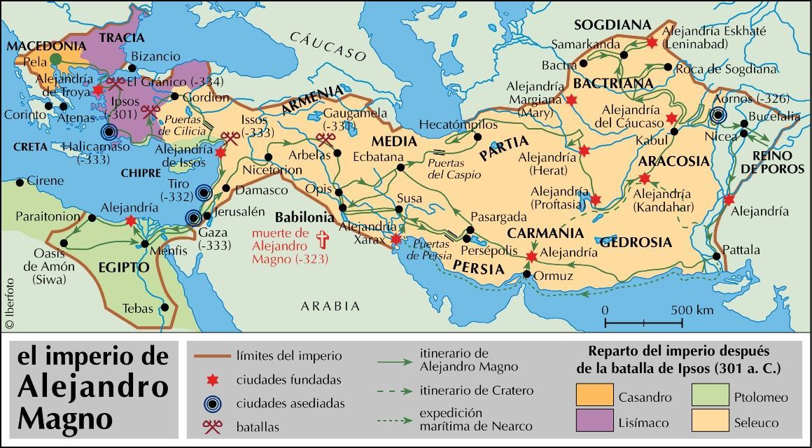

# Teoría UD2 · Historia: de Grecia a Roma

!!! info "Obxectivos da unidade"
    - Comprender as etapas fundamentais da historia grega (**minoica/micénica, arcaica, clásica e helenística**).
    - Identificar as fases da historia romana (**monarquía, república e imperio**) e os seus fitos esenciais.
    - Situar nunha liña do tempo **dez acontecementos clave**.
    - Explicar a influencia da cultura grega sobre Roma e a construción dun **espazo mediterráneo común**.

---

## 1. Grecia

A **civilización grega** desenvolveuse nun espazo fragmentado en pequenas **polis** (cidades-estado). Cada polis tiña o seu territorio, as súas institucións e a súa divindade protectora. Grecia non foi nunca un Estado unificado, senón unha constelación de comunidades independentes. A expansión polo Mediterráneo mediante a **colonización** (séculos VIII–VI a.n.e.) permitiu estender a cultura grega a moitas rexións, desde Asia Menor ata a Magna Grecia en Italia.  
A cultura grega marcou para sempre a política, a arte e o pensamento de Europa.

---

### 1.1 Etapas históricas (visión xeral)

A historia grega pódese dividir en seis grandes períodos.  

  

    <strong>2000–1400 a.n.e.</strong> — Civilización minoica (Creta): palacios como Cnosos, economía palacial e comercio mariño.
  

  

    <strong>1600–1100 a.n.e.</strong> — Cultura micénica (continente): cidadelas como Micenas ou Tirinto, elites guerreiras e armas de bronce.
  

  

    <strong>1100–800 a.n.e.</strong> — Idade escura: retroceso demográfico, desaparición da escritura e crise económica.
  

  

    <strong>800–500 a.n.e.</strong> — Período arcaico: nacemento das polis, colonización mediterránea e aparición do alfabeto grego.
  

  

    <strong>500–323 a.n.e.</strong> — Período clásico: Guerras Médicas, rivalidade Atenas–Esparta, esplendor cultural e Guerra do Peloponeso.
  

  

    <strong>323–31 a.n.e.</strong> — Período helenístico: tras Alexandre Magno, difusión da cultura grega nos grandes reinos helenísticos.
  

!!! example "Mapa interactivo · Polis e colonización (placeholder)"
    

      <iframe 
          src="../assets/mapa_grecia_interactivo.html"
          title="Mapa interactivo: Grecia clásica (polis, santuarios, batallas)"
          loading="lazy"
          allowfullscreen
          style="border:0;"></iframe>
    

---

### 1.2 Do mundo palacial á polis

{.zoom width="65%" .rounded }
{.zoom width="65%" .rounded }

- **Civilización minoica (Creta)**:  
    - Desenvolveuse na illa de **Creta** entre os anos 2000–1400 a.n.e.  
    - Organizábase arredor de grandes **palacios** (Cnosos, Festos, Malia), que eran á vez centros políticos, económicos e relixiosos.  
    - Destacan os **frescos policromos** con escenas naturais e mariñas, que mostran unha sociedade refinada e aberta ao mar.  
    - Utilizaban a **escritura [lineal A](https://pt.wikipedia.org/wiki/Linear_A)**, aínda non descifrada.  
    - A súa economía baseábase no **comercio marítimo**, polo que Creta converteuse nunha potencia naval do Exeo.  
    - Relixión de carácter **naturalista** e **feminino**: cultos á deusa nai, ao touro (mito do Minotauro).  

- **Cultura micénica (continente)**:  
    - Desenvolveuse no continente grego (1600–1100 a.n.e.), en cidades como **Micenas**, **Tirinto** ou **Pilos**.  
    - Tiña unha sociedade **xerárquica e guerreira**, dirixida por reis (wanax) apoiados por unha aristocracia militar.  
    - Construíron **cidadelas fortificadas** e **tumbas monumentais** (tholos, como a “tumba de Atreo”).  
    - Desenvolveron unha **escritura propia, o [lineal B](https://pt.wikipedia.org/wiki/Linear_B)**, que xa foi descifrada e que representa unha forma arcaica do grego.  
    - A súa cultura militar reflíctese nos poemas homéricos (*Ilíada*, *Odisea*), que transmiten ecos dun pasado heroico.  

- **Tras a Idade Escura (1100–800 a.n.e.)**:  
    - Con as invasións dóricas e a caída do mundo micénico produciuse un **retroceso demográfico, económico e cultural**: desapareceu a escritura, reduciuse o comercio e as aldeas quedaron illadas.  
    - A partir do século VIII a.n.e. houbo unha recuperación:  
        - Reaparece a **escritura** mediante a adaptación do **alfabeto fenicio**, que deu lugar ao grego.  
        - Fórmanse as **polis**, comunidades políticas independentes cun núcleo urbano e un territorio agrícola arredor.  
        - Nace un **novo sistema social** baseado na cidadanía, na participación política (aínda limitada a homes libres) e no concepto de comunidade.  

---

!!! info "Institucións e sociedade"
    - **A polis**:  
        - Era a comunidade política fundamental en Grecia.  
        - Combinaba un **espazo urbano** (asty) cun **espazo rural** (chora).  
        - Os cidadáns homes libres participaban na **asemblea** e elixían ou ocupaban as **maxistraturas**.  
        - Había tamén non-cidadáns: mulleres, metecos (estranxeiros residentes) e escravos.  

    - **Economía**:  
        - Agricultura da **tríade mediterránea** (trigo, vide, oliveira).  
        - **Artesanía especializada** (cerámica, metalurxia, tecidos).  
        - **Comercio marítimo**, facilitado pola xeografía grega de illas e costas recortadas.  

    - **Colonización (s. VIII–VI a.n.e.)**:  
        - As polis, ante o aumento de poboación e a escaseza de terras, fundaron novas cidades ao longo do **Mediterráneo e Mar Negro**.  
        - Creáronse polis na costa de Asia Menor, no sur de Italia e Sicilia (*Magna Grecia*), en Galia, Exipto ou Cirene (Libia).  
        - A colonización permitiu difundir a lingua, a relixión e as formas políticas gregas, creando un **espazo cultural común**.  

??? tip "Vídeo: A polis grega en 5' (placeholder)"
    

      <iframe width="560" height="315" src="https://www.youtube.com/embed/IaV4rNo_OS8?si=FJv3XGfNqditzGVk" title="YouTube video player" frameborder="0" allow="accelerometer; autoplay; clipboard-write; encrypted-media; gyroscope; picture-in-picture; web-share" referrerpolicy="strict-origin-when-cross-origin" allowfullscreen></iframe>
    

---

### 1.3 O período clásico: Atenas, Esparta e as guerras

{.zoom width="65%" .rounded }

O chamado **período clásico** (séculos V–IV a.n.e.) é a etapa de maior esplendor da civilización grega e o momento en que se consolidan moitas das bases políticas, artísticas e intelectuais que influíron na cultura europea posterior.

---

#### As Guerras Médicas (490–479 a.n.e.)

Durante o século V a.n.e., o Imperio Persa intentou someter as polis gregas. A resistencia foi liderada principalmente por **Atenas** e **Esparta**:

* En **Maratón (490 a.n.e.)**, os atenienses derrotaron sorprendentemente ao exército persa.
* En **Termópilas (480 a.n.e.)**, un pequeno grupo de espartanos, encabezados polo rei **Leónidas**, resistiu heroicamente fronte a un inimigo inmensamente superior.
* En **Salamina (480 a.n.e.)**, a frota ateniense obtivo unha vitoria naval decisiva.

Estas batallas convertéronse en símbolos da identidade grega e da defensa da liberdade fronte á tiranía.

---

#### O esplendor de Atenas

Logo das Guerras Médicas, Atenas asumiu a hexemonía mediante a **Liga de Delos**, unha alianza militar que se converteu nun auténtico imperio mariñeiro.

Baixo o liderado de **Pericles** (mediados do século V a.n.e.):

* Consolidouse a **democracia ateniense**, cunha participación cidadá directa nas asembleas.
* Viviu un gran **esplendor cultural**, con autores como **Esquilo, Sófocles e Eurípides** no teatro, **Heródoto** e **Tucídides** na historiografía, **Sócrates** na filosofía.
* A **Acrópole** foi monumentalizada con edificios como o **Partenón**, símbolo da arte clásica e da confianza no ser humano.

Atenas converteuse así no faro cultural de Grecia, aínda que a súa hexemonía xerou recelos noutras polis.

---

#### A Guerra do Peloponeso (431–404 a.n.e.)

A rivalidade entre **Atenas** (potencia naval, democrática e imperialista) e **Esparta** (potencia terrestre, de carácter militarista e oligárquico) desembocou nun longo conflito que dividiu ás polis en dous bandos: a **Liga de Delos** e a **Liga do Peloponeso**.

A guerra prolongouse case tres décadas, con fases de tregua e reanudacións, epidemias como a que matou a Pericles, e intervencións exteriores (Persia apoiou finalmente a Esparta).

O resultado foi a **derrota de Atenas** no 404 a.n.e. e a breve hexemonía espartana. Con todo, o desgaste xeral debilitou ás polis gregas, facilitando a súa posterior conquista por Macedonia.

---

#### Balance do período clásico

O período clásico grego combina:

* **Esplendor cultural e político**, que deu lugar á democracia, a filosofía e as grandes obras de arte.
* **Conflitos internos**, que minaron a unidade helénica e deixaron Grecia vulnerable.

É unha etapa brillante e contraditoria: ao tempo que se formulaban os principios da liberdade cidadá, as guerras fratricidas impedían a consolidación dunha unidade política duradeira.

---

### 1.4 O mundo helenístico

{.zoom width="65%" .rounded }

O **mundo helenístico** abrangue o período entre a morte de **Alexandre Magno** (323 a.n.e.) e a conquista romana de Exipto (31 a.n.e.). Foi unha etapa de transformación na que a cultura grega se difundiu por vastos territorios e se mesturou coas tradicións orientais.

---

#### Alexandre Magno (356–323 a.n.e.)

* Rei de **Macedonia**, educado por **Aristóteles**.
* Unificou Grecia e lanzou unha campaña militar que conquistou:

    * Asia Menor,
    * Exipto (onde fundou **Alexandría**),
    * Mesopotamia e Persia,
    * chegando ata o val do Indo.

* O seu proxecto de imperio universal rematou coa súa morte prematura en **Babilonia (323 a.n.e.)**.

---

#### Os reinos helenísticos

Tras a morte de Alexandre, o imperio fragmentouse en varios estados gobernados polos seus xenerais (**diádocos**). Os máis importantes foron:

* **Ptolomeos en Exipto**: dinastía que fixo de Alexandría un centro cultural coa súa famosa **biblioteca**.
* **Seléucidas en Asia**: dominaban Siria, Mesopotamia e parte de Persia.
* **Antigónidas en Macedonia e Grecia**: continuaban a tradición helénica no ámbito máis próximo.

---

#### A mestizaxe cultural

* Xorde unha intensa **mestura entre Grecia e Oriente**, tanto en relixión, costumes como en arte.
* A lingua grega común, a **koiné**, converteuse na lingua internacional de comunicación no Mediterráneo oriental.
* As cidades fundadas por Alexandre e polos seus sucesores foron focos de comercio e cultura, con poboacións diversas.

---

#### A cultura helenística

O período caracterízase por avances notables en diversos campos:

* **Arte**:

    * Máis expresiva e realista que no clasicismo.
    * Exemplos célebres: a **Venus de Milo**, o **Laocoonte**.

* **Ciencia**:

    * **Euclides** (matemáticas e xeometría).
    * **Arquímedes** (mecánica, enxeñaría).
    * **Hiparco** (astronomía).

* **Filosofía**:

    * **Estoicismo** (Zenón de Citio): vivir segundo a razón e a natureza.
    * **Epicureísmo** (Epicuro): busca da felicidade a través da moderación e a amizade.
    * **Escepticismo** (Pirro): imposibilidade de alcanzar certezas absolutas.  

---

## 2. Roma

**Roma** pasa de monarquía a **república** (expansión por Italia e o Mediterráneo) e despois ao **imperio**, que integra unha enorme diversidade baixo leis, infraestruturas e cidades.

### 2.1 Etapas históricas (visión xeral)

**Secuencia básica (sen mermaid):**
- **753–509 a.n.e. · Monarquía** (tradición e influencias etruscas).
- **509–27 a.n.e. · República** → Senado, maxistraturas; expansión e **Guerras Púnicas**.
- **27 a.n.e.–235 d.C. · Principado** (de **Augusto** a Severos) → **Pax Romana**.
- **235–284 d.C. · Crise do século III**.
- **284–476 d.C. · Dominado**; reformas de Diocleciano/Constantino; **476**: caída de Occidente (pervive Oriente).

!!! example "Mapa interactivo · Expansión romana (placeholder)"
    

      <iframe 
          src="../assets/mapa_expansion_romana_interactivo.html"
          title="Mapa interactivo: expansión de Roma"
          loading="lazy"
          allowfullscreen
          style="border:0;"></iframe>
    

### 2.2 República: institucións e expansión

- **Institucións**: **Senado**, **cónsules**, **pretores**, **tribunos da plebe**.
- **Expansión**: control de Italia; **Guerras Púnicas** (Cartago) → dominio do Mediterráneo.
- **Infraestruturas**: **vías** (Appia, Flaminia), **acuedutos**, **portos** (Óstia/Portus).

### 2.3 Imperio: de Augusto á crise

{.zoom width="65%" .rounded }

- **Augusto (27 a.n.e.)**: inicio do **Principado**; **Pax Romana** (s. I–II d.C.).
- **Século III**: crises militares/económicas; reformas de **Diocleciano** e **Constantino**.
- **División (395)** e **476 d.C.**: caída de Occidente (o Oriente bizantino continúa).

??? tip "Vídeo: Roma da República ao Imperio (placeholder)"
    

      <iframe src="https://www.youtube.com/embed/ID_VIDEO_ROMA"
              title="Roma: República → Imperio"
              loading="lazy" allowfullscreen></iframe>
    

---

## 3. Cronoloxía comparada

!!! example "Táboa sincrónica (séculos e fitos)"
    | Século | Grecia | Roma |
    |---:|---|---|
    | **VIII a.n.e.** | Polis arcaicas; colonización | Fundación lendaria (753 a.n.e.); monarquía |
    | **VI a.n.e.** | Reformas en Atenas (Solón/Clístenes) | Fin da monarquía; **República** (509 a.n.e.) |
    | **V a.n.e.** | **Guerras Médicas**; Peloponeso | Conquista de Italia central |
    | **IV a.n.e.** | **Alexandre**; helenismo | Guerras samnitas; Italia |
    | **III–II a.n.e.** | Reinos helenísticos | **Guerras Púnicas**; dominio mediterráneo |
    | **I a.n.e.** | Integración en órbita romana | Crises; **Augusto** (27 a.n.e.) |
    | **I–II d.C.** | Cultura helenística viva | **Pax Romana**; apoxeo |
    | **III–V d.C.** | — | Crise; división; **476 d.C.** |

---

## 4. Grecia → Roma: herdanza e influencia

Roma **admira e integra** Grecia: relixión, arte, pensamento, educación…

  

    💡
  

  

    

      Sabías que…?
    

    <ul style="margin:0;padding-left:18px;color:#064e3b;">
      <li>Moitos mestres e artistas activos en Roma eran <em>gregos</em> ou formados en tradición grega.</li>
      <li>Os romanos traduciron e reescribiron moitos xéneros: epopea, teatro, filosofía…</li>
      <li>O latín incorporou numerosos <em>helenismos</em> (e nós herdámolos nas linguas romances).</li>
    </ul>
  

!!! info "Puntos clave da transferencia cultural"
    - **Relixión/mitoloxía**: identificación de deuses (Zeus→Xúpiter, Atenea→Minerva, etc.).
    - **Arte/arquitectura**: ordes clásicas (dórico, xónico, corintio) e adaptacións romanas (arco e bóveda).
    - **Pensamento/educación**: estoicismo, epicureísmo, retórica; **paideía** grega en Roma.
    - **Ciencia/técnica**: Hipócrates–Galeno, Euclides–Arquímedes, Estrabón.
    - **Romanización**: fixo universal a herdanza grega no Mediterráneo.

??? tip "Vídeo: Que herdou Roma de Grecia? (placeholder)"
    

      <iframe src="https://www.youtube.com/embed/ID_VIDEO_HELENIZACION"
              title="Grecia → Roma: herdanza"
              loading="lazy" allowfullscreen></iframe>
    

---

## 5. Exercicios (solucións ocultas)

1️⃣ **Liña do tempo de Grecia**  
??? example "Ordea os fitos — solución posible"
    1. Civilización minoica (c. 2000–1400 a.n.e.)  
    2. Cultura micénica (c. 1600–1100 a.n.e.)  
    3. Idade escura (c. 1100–800 a.n.e.)  
    4. Período arcaico (c. 800–500 a.n.e.)  
    5. Período clásico (c. 500–323 a.n.e.)  
    6. Período helenístico (323–31 a.n.e.)

2️⃣ **Liña do tempo de Roma**  
??? example "Fitos principais — solución posible"
    1. Fundación lendaria (753 a.n.e.) → Monarquía  
    2. República (509 a.n.e.)  
    3. Guerras púnicas (264–146 a.n.e.)  
    4. Ditadura de César (49–44 a.n.e.)  
    5. Imperio con Augusto (27 a.n.e.)  
    6. Pax Romana (s. I–II d.C.)  
    7. Crise do s. III → Reformas  
    8. División (395) → 476 (Occidente)

3️⃣ **Grecia → Roma (6–8 liñas)**  
??? example "Resposta modelo"
    Roma adaptou deuses e mitos gregos, asumiu modelos artísticos e filosóficos e incorporou a paideía (educación) helénica ás elites. Co Imperio, a herdanza grega espallouse por todo o Mediterráneo, construíndo un **espazo cultural común** helenístico-romano.

- [ ] **Tarefa de portfolio:**  
      **Liña do tempo ilustrada** con 10 fitos (5 Grecia + 5 Roma).  
      Para cada fito: **data**, **2–3 liñas** e **icona/imaxe**.

---

## 6. Materiais imprimibles (placeholders)

- **Apuntes completos (PDF):** ../materiais/ud2_apuntes.pdf  
- **Esquema cronolóxico (JPG/PNG):** ../materiais/esquema_cronoloxia.jpg  
- **Mapas en alta calidade (PDF):**
  - ../materiais/mapa_mediterraneo.pdf
  - ../materiais/mapa_polis_gregas.pdf
  - ../materiais/mapa_expansion_romana.pdf

---

## 7. Textos para comentar (placeholders)

- **Tucídides**, *Guerra do Peloponeso* (selección adaptada): ../textos/tucidides_peloponeso.md  
- **Tito Livio**, *Ab urbe condita* (fundación de Roma, adapt.): ../textos/tito_livio_fundacion.md

<small>Cada texto debería incluír: vocabulario, contextualización, preguntas de comprensión e relación cronolóxica.</small>

---

