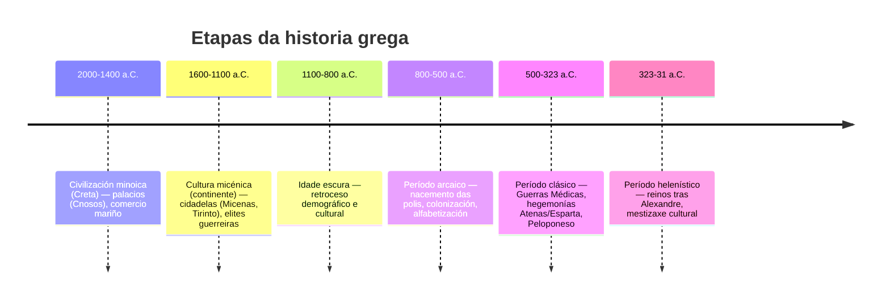

# Teoría UD2 · Historia: de Grecia a Roma

!!! info "Obxectivos da unidade"
    - Comprender as etapas fundamentais da historia grega (**minoica/micénica, arcaica, clásica e helenística**).
    - Identificar as fases da historia romana (**monarquía, república e imperio**) e os seus fitos esenciais.
    - Situar nunha liña do tempo **dez acontecementos clave**.
    - Explicar a influencia da cultura grega sobre Roma e a construción dun **espazo mediterráneo común**.

---

## 1. Grecia

A **civilización grega** desenvolveuse nun espazo de **polis** (cidades-estado) e expandiuse polo Mediterráneo mediante a **colonización**. A cultura grega marcou para sempre a política, a arte e o pensamento de Europa.

### 1.1 Etapas históricas (visión xeral)

!!! example "Mapa interactivo · Polis e colonización (placeholder)"
    

      <iframe 
          src="../assets/mapa_grecia_interactivo.html"
          title="Mapa interactivo: Grecia clásica (polis, santuarios, batallas)"
          loading="lazy"
          allowfullscreen
          style="border:0;"></iframe>
    

    <small>📌 Sube/usa un HTML Leaflet con polis clave (Atenas, Esparta, Corinto…), santuarios (Delfos, Olimpia, Epidauro) e batallas (Maratón, Salamina, Termópilas).</small>

### 1.2 Do mundo palacial á polis

{.zoom width="65%" .rounded }
{.zoom width="65%" .rounded }

- **Minoica (Creta)**: palacios como **Cnosos**, economía palacial e comercio marítimo.
- **Micénica**: fortalezas (**Micenas**, **Tirinto**), armas de bronce, elites guerreiras.
- Tras a **Idade escura**, xorden as **polis** (Atenas, Esparta, Tebas…) con institucións propias.

!!! info "Institucións e sociedade"
    - **Polis**: cidadanía masculina, asemblea, maxistraturas.
    - **Economía**: tríade mediterránea, artesanía, comercio marítimo.
    - **Colonización** (s. VIII–VI a.C.): novas polis polo Exeo, Mar Negro e occidente (*Magna Grecia*).

??? tip "Vídeo: A polis grega en 5' (placeholder)"
    

      <iframe src="https://www.youtube.com/embed/ID_VIDEO_POLIS"
              title="A polis grega"
              loading="lazy" allowfullscreen></iframe>
    

### 1.3 O clásico: Atenas, Esparta e as guerras

{.zoom width="65%" .rounded }

- **Guerras Médicas** (s. V a.C.): resistencia grega fronte a Persia (Maratón, Salamina).
- **Hegemonía ateniense**: democracia, teatro, filosofía.
- **Guerra do Peloponeso**: rivalidade **Atenas–Esparta** → desgaste xeral.

### 1.4 O mundo helenístico

{.zoom width="65%" .rounded }

Tras **Alexandre Magno**, o mundo grego esténdese a Exipto e Asia. Nacen grandes **reinos helenísticos** (Ptolomeos, Seléucidas, Antigónidas): **mestizaxe cultural** e difusión do grego (*koiné*).

---

## 2. Roma

**Roma** pasa de monarquía a **república** (expansión por Italia e o Mediterráneo) e despois ao **imperio**, que integra unha enorme diversidade baixo leis, infraestruturas e cidades.

### 2.1 Etapas históricas (visión xeral)

**Secuencia básica (sen mermaid):**
- **753–509 a.C. · Monarquía** (tradición e influencias etruscas).
- **509–27 a.C. · República** → Senado, maxistraturas; expansión e **Guerras Púnicas**.
- **27 a.C.–235 d.C. · Principado** (de **Augusto** a Severos) → **Pax Romana**.
- **235–284 d.C. · Crise do século III**.
- **284–476 d.C. · Dominado**; reformas de Diocleciano/Constantino; **476**: caída de Occidente (pervive Oriente).

!!! example "Mapa interactivo · Expansión romana (placeholder)"
    

      <iframe 
          src="../assets/mapa_expansion_romana_interactivo.html"
          title="Mapa interactivo: expansión de Roma"
          loading="lazy"
          allowfullscreen
          style="border:0;"></iframe>
    

    <small>📌 Sube/usa un HTML Leaflet cunha liña temporal de expansión (Italia, Púnicas, Oriente, provincias).</small>

### 2.2 República: institucións e expansión

- **Institucións**: **Senado**, **cónsules**, **pretores**, **tribunos da plebe**.
- **Expansión**: control de Italia; **Guerras Púnicas** (Cartago) → dominio do Mediterráneo.
- **Infraestruturas**: **vías** (Appia, Flaminia), **acuedutos**, **portos** (Óstia/Portus).

### 2.3 Imperio: de Augusto á crise

{.zoom width="65%" .rounded }

- **Augusto (27 a.C.)**: inicio do **Principado**; **Pax Romana** (s. I–II d.C.).
- **Século III**: crises militares/económicas; reformas de **Diocleciano** e **Constantino**.
- **División (395)** e **476 d.C.**: caída de Occidente (o Oriente bizantino continúa).

??? tip "Vídeo: Roma da República ao Imperio (placeholder)"
    

      <iframe src="https://www.youtube.com/embed/ID_VIDEO_ROMA"
              title="Roma: República → Imperio"
              loading="lazy" allowfullscreen></iframe>
    

---

## 3. Cronoloxía comparada

!!! example "Táboa sincrónica (séculos e fitos)"
    | Século | Grecia | Roma |
    |---:|---|---|
    | **VIII a.C.** | Polis arcaicas; colonización | Fundación lendaria (753 a.C.); monarquía |
    | **VI a.C.** | Reformas en Atenas (Solón/Clístenes) | Fin da monarquía; **República** (509 a.C.) |
    | **V a.C.** | **Guerras Médicas**; Peloponeso | Conquista de Italia central |
    | **IV a.C.** | **Alexandre**; helenismo | Guerras samnitas; Italia |
    | **III–II a.C.** | Reinos helenísticos | **Guerras Púnicas**; dominio mediterráneo |
    | **I a.C.** | Integración en órbita romana | Crises; **Augusto** (27 a.C.) |
    | **I–II d.C.** | Cultura helenística viva | **Pax Romana**; apoxeo |
    | **III–V d.C.** | — | Crise; división; **476 d.C.** |

---

## 4. Grecia → Roma: herdanza e influencia

Roma **admira e integra** Grecia: relixión, arte, pensamento, educación…

  

    💡
  

  

    

      Sabías que…?
    

    <ul style="margin:0;padding-left:18px;color:#064e3b;">
      <li>Moitos mestres e artistas activos en Roma eran <em>gregos</em> ou formados en tradición grega.</li>
      <li>Os romanos traduciron e reescribiron moitos xéneros: epopea, teatro, filosofía…</li>
      <li>O latín incorporou numerosos <em>helenismos</em> (e nós herdámolos nas linguas romances).</li>
    </ul>
  

!!! info "Puntos clave da transferencia cultural"
    - **Relixión/mitoloxía**: identificación de deuses (Zeus→Xúpiter, Atenea→Minerva, etc.).
    - **Arte/arquitectura**: ordes clásicas (dórico, xónico, corintio) e adaptacións romanas (arco e bóveda).
    - **Pensamento/educación**: estoicismo, epicureísmo, retórica; **paideía** grega en Roma.
    - **Ciencia/técnica**: Hipócrates–Galeno, Euclides–Arquímedes, Estrabón.
    - **Romanización**: fixo universal a herdanza grega no Mediterráneo.

??? tip "Vídeo: Que herdou Roma de Grecia? (placeholder)"
    

      <iframe src="https://www.youtube.com/embed/ID_VIDEO_HELENIZACION"
              title="Grecia → Roma: herdanza"
              loading="lazy" allowfullscreen></iframe>
    

---

## 5. Exercicios (solucións ocultas)

1️⃣ **Liña do tempo de Grecia**  
??? example "Ordea os fitos — solución posible"
    1. Civilización minoica (c. 2000–1400 a.C.)  
    2. Cultura micénica (c. 1600–1100 a.C.)  
    3. Idade escura (c. 1100–800 a.C.)  
    4. Período arcaico (c. 800–500 a.C.)  
    5. Período clásico (c. 500–323 a.C.)  
    6. Período helenístico (323–31 a.C.)

2️⃣ **Liña do tempo de Roma**  
??? example "Fitos principais — solución posible"
    1. Fundación lendaria (753 a.C.) → Monarquía  
    2. República (509 a.C.)  
    3. Guerras púnicas (264–146 a.C.)  
    4. Ditadura de César (49–44 a.C.)  
    5. Imperio con Augusto (27 a.C.)  
    6. Pax Romana (s. I–II d.C.)  
    7. Crise do s. III → Reformas  
    8. División (395) → 476 (Occidente)

3️⃣ **Grecia → Roma (6–8 liñas)**  
??? example "Resposta modelo"
    Roma adaptou deuses e mitos gregos, asumiu modelos artísticos e filosóficos e incorporou a paideía (educación) helénica ás elites. Co Imperio, a herdanza grega espallouse por todo o Mediterráneo, construíndo un **espazo cultural común** helenístico-romano.

- [ ] **Tarefa de portfolio:**  
      **Liña do tempo ilustrada** con 10 fitos (5 Grecia + 5 Roma).  
      Para cada fito: **data**, **2–3 liñas** e **icona/imaxe**.

---

## 6. Materiais imprimibles (placeholders)

- **Apuntes completos (PDF):** ../materiais/ud2_apuntes.pdf  
- **Esquema cronolóxico (JPG/PNG):** ../materiais/esquema_cronoloxia.jpg  
- **Mapas en alta calidade (PDF):**
  - ../materiais/mapa_mediterraneo.pdf
  - ../materiais/mapa_polis_gregas.pdf
  - ../materiais/mapa_expansion_romana.pdf

---

## 7. Textos para comentar (placeholders)

- **Tucídides**, *Guerra do Peloponeso* (selección adaptada): ../textos/tucidides_peloponeso.md  
- **Tito Livio**, *Ab urbe condita* (fundación de Roma, adapt.): ../textos/tito_livio_fundacion.md

<small>Cada texto debería incluír: vocabulario, contextualización, preguntas de comprensión e relación cronolóxica.</small>

---

